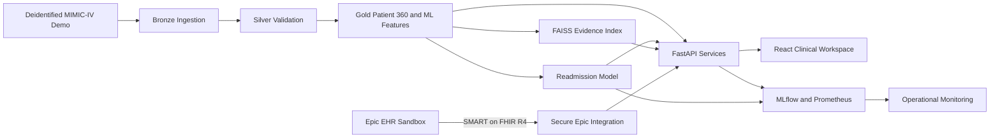

# Enterprise Clinical AI Platform with Epic SMART on FHIR Integration

**MedNexus AI** is an end-to-end clinical intelligence platform for governed healthcare data engineering, patient analytics, machine learning, grounded retrieval, and standards-based EHR interoperability.

The project demonstrates how deidentified clinical data can move from validated medallion pipelines into a patient 360 experience, readmission-risk model, evidence-grounded AI workflows, operational monitoring, and a sandbox-ready Epic SMART on FHIR R4 integration.

> [!IMPORTANT]
> This repository is for research, education, and portfolio demonstration. It uses deidentified data, is not a medical device, does not provide diagnoses, and is not authorized for direct patient care. It contains a HIPAA-readiness technical foundation—not a HIPAA certification.

## Highlights

- Governed Bronze, Silver, and Gold healthcare data pipelines
- Explicit schemas, quarantine handling, lineage, and data-quality gates
- Patient 360 profiles and longitudinal admission timelines
- Patient-disjoint 30-day readmission modeling with MLflow tracking
- FAISS clinical retrieval with source and admission provenance
- Evidence-constrained clinical assistant with auditable tool execution
- Versioned FastAPI services with request IDs and Prometheus metrics
- Responsive React and TypeScript clinical operations dashboard
- Kafka event contracts with idempotency and duplicate-delivery tests
- Epic SMART App Launch foundation using FHIR R4 and OAuth 2.0 PKCE
- PostgreSQL, Redis, Kafka, MinIO, Spark, MLflow, Prometheus, and Grafana
- Docker Compose development environment and CI quality gates

## Architecture



## Application workspace

The web application contains separate operational routes:

| Workspace | Purpose |
| --- | --- |
| Executive overview | Platform metrics, patient cohort, quality gates, and latest pipeline run |
| Patient explorer | Patient 360 profile and longitudinal admission timeline |
| Readmission risk | Validated model input and traceable risk response |
| Clinical search | Evidence retrieval with document, admission, patient, and source provenance |
| AI assistant | Evidence-constrained responses with tool and audit identifiers |
| Data quality | Artifact-backed rule results and failure counts |
| Model monitoring | Evaluation metrics, operating threshold, lineage, and retrieval metadata |
| Epic EHR integration | SMART/FHIR configuration and healthcare security posture |

## Technology stack

| Area | Technologies |
| --- | --- |
| Frontend | React, TypeScript, Vite, React Router |
| API | Python, FastAPI, Pydantic |
| Data engineering | Pandas, PySpark, Parquet, medallion architecture |
| Machine learning | scikit-learn, MLflow |
| Retrieval and AI | Sentence Transformers, FAISS, evidence-grounded orchestration |
| Interoperability | HL7 FHIR R4, Epic SMART App Launch, OAuth 2.0 PKCE |
| Streaming | Kafka, schema contracts, idempotent processing |
| Storage | PostgreSQL, Redis, MinIO |
| Observability | Prometheus, Grafana, structured request telemetry |
| Platform | Docker Compose, Nginx, GitHub Actions |

## Verified demonstration results

The checked-in code was validated against the permitted deidentified demo cohort.

| Capability | Verified result |
| --- | ---: |
| Patients processed | 100 |
| Admissions processed | 275 |
| Eligible readmission records | 260 |
| Critical data-quality checks | 4 passed, 0 failures |
| Readmission PR-AUC | 0.298 |
| Readmission ROC-AUC | 0.552 |
| Retrieval Precision@5 | 0.778 |
| Retrieval evaluation queries | 9 |
| Retrieval mean latency | 24.86 ms |
| API prediction p95 latency | 52.62 ms |
| Unit tests | 20 passed |

These measurements describe a small demonstration dataset and are not evidence of clinical effectiveness. Detailed methodology and limitations are documented in [BENCHMARKS.md](docs/BENCHMARKS.md).

## Quick start

### Prerequisites

- Python 3.11 or 3.12
- Node.js and pnpm
- Docker Desktop using Linux containers
- Git
- Authorized MIMIC-IV demo source files

### 1. Configure the environment

```powershell
git clone https://github.com/saithanuj2/Enterprise-Clinical-AI-Platform-with-Epic-SMART-on-FHIR-Integration.git
Set-Location Enterprise-Clinical-AI-Platform-with-Epic-SMART-on-FHIR-Integration
Copy-Item .env.example .env
```

The local template contains development-only values. Replace all example credentials before using a shared environment.

### 2. Install the application

```powershell
py -3.12 -m venv .venv
.\.venv\Scripts\python.exe -m pip install --upgrade pip
.\.venv\Scripts\python.exe -m pip install -e ".[api,ml,ai,dev]"

Set-Location apps\web
pnpm install
Set-Location ..\..
```

### 3. Run the verified local pipeline

Place authorized files under `data/raw/hosp/`. Raw and derived clinical data are excluded from Git.

```powershell
.\.venv\Scripts\python.exe pipelines\run_demo_pipeline.py --engine pandas
.\.venv\Scripts\python.exe ml\training\train_readmission.py
.\.venv\Scripts\python.exe ai\retrieval\build_index.py
```

### 4. Start the local application

API:

```powershell
$env:PYTHONPATH = (Resolve-Path "src").Path
.\.venv\Scripts\python.exe -m uvicorn mednexus.api.app:app --host 127.0.0.1 --port 8000
```

Web application in a second terminal:

```powershell
Set-Location apps\web
pnpm dev --host 127.0.0.1 --port 5173
```

Open:

- Clinical workspace: <http://localhost:5173>
- Interactive API documentation: <http://localhost:8000/docs>
- API health: <http://localhost:8000/api/v1/health>

## Docker platform

Validate and start the complete local platform:

```powershell
docker compose config --quiet
docker compose up -d --build
docker compose ps
```

| Service | URL |
| --- | --- |
| MedNexus dashboard | <http://localhost:5173> |
| FastAPI documentation | <http://localhost:8000/docs> |
| MLflow | <http://localhost:5000> |
| Kafka UI | <http://localhost:8081> |
| MinIO console | <http://localhost:9001> |
| Prometheus | <http://localhost:9090> |
| Grafana | <http://localhost:3000> |

To preserve local volumes, stop the platform with `docker compose stop`. Do not run `docker compose down -v` unless permanent data removal is intentional.

## Epic SMART on FHIR

The Epic integration is disabled by default. It implements:

- SMART discovery
- Authorization-code flow with PKCE
- Strict issuer and endpoint-origin validation
- Single-use launch state
- Encrypted Redis storage for authorization state and tokens
- Opaque HttpOnly browser sessions
- Allowlisted Patient, Encounter, and Observation reads
- FHIR JSON validation and bounded same-origin pagination

A registered Epic non-production client ID is required for sandbox login. Configuration and callback instructions are available in [EPIC_FHIR_INTEGRATION.md](docs/EPIC_FHIR_INTEGRATION.md).

No Epic credentials, access tokens, refresh tokens, real patient records, or private keys belong in this repository.

## API surface

Core endpoints include:

```text
GET  /api/v1/health
GET  /api/v1/ready
GET  /api/v1/patients
GET  /api/v1/patients/{subject_id}
GET  /api/v1/patients/{subject_id}/timeline
POST /api/v1/predict/readmission
POST /api/v1/search
POST /api/v1/rag/query
POST /api/v1/agent/query
GET  /api/v1/data-quality
GET  /api/v1/operations/summary
GET  /api/v1/integrations/epic/status
GET  /api/v1/integrations/epic/launch
GET  /api/v1/integrations/epic/callback
GET  /api/v1/integrations/epic/fhir/{resource_type}/{resource_id}
```

## Quality checks

```powershell
.\.venv\Scripts\python.exe -m ruff check .
.\.venv\Scripts\python.exe -m mypy src
.\.venv\Scripts\python.exe -m pytest -m "not integration"

Set-Location apps\web
pnpm build
pnpm audit --prod
```

Infrastructure integration tests require healthy Docker services:

```powershell
.\.venv\Scripts\python.exe -m pytest -m integration
```

## Repository structure

```text
apps/web/                  React and TypeScript clinical workspace
src/mednexus/api/          FastAPI application
src/mednexus/data/         Medallion processing and quality validation
src/mednexus/ml/           Readmission model utilities
src/mednexus/retrieval/    FAISS indexing and grounded retrieval
src/mednexus/integrations/ Epic SMART on FHIR and FHIR R4 client
pipelines/                 Ingestion registry and pipeline entry points
ml/training/               Model training workflow
ai/retrieval/              Retrieval index workflow
database/                  PostgreSQL initialization and Alembic migrations
infrastructure/            Container images and Nginx configuration
monitoring/                Prometheus and Grafana configuration
tests/                     Unit and infrastructure integration tests
docs/                      Architecture, security, benchmarks, and runbooks
```

## Security and HIPAA readiness

The repository excludes environment secrets, controlled clinical datasets, derived patient records, model binaries, MLflow runs, private keys, and local build output.

HIPAA compliance cannot be established by source code alone. It also requires organizational risk analysis, administrative and physical safeguards, workforce procedures, business associate agreements, incident response, contingency planning, audit review, and evidence from the actual deployment.

The implemented controls are documented in:

- [Security model](docs/SECURITY.md)
- [HIPAA readiness boundary](docs/HIPAA_READINESS.md)
- [Epic FHIR integration](docs/EPIC_FHIR_INTEGRATION.md)
- [Architecture](docs/ARCHITECTURE.md)
- [Operational runbook](docs/RUNBOOK.md)

The application intentionally reports `live_phi_allowed: false` until an accountable organization completes and accepts the required deployment controls.

## Current limitations

- The model is trained on a small deidentified demonstration cohort and is not clinically validated.
- Current end-to-end data coverage focuses on patients and admissions.
- The grounded answer composer is extractive because no external generative-model credential is required.
- Live Epic access requires an Epic-registered application, customer-specific approval, and approved hosting.
- General workforce identity, enterprise RBAC, immutable production audit retention, and managed-cloud controls remain deployment milestones.

## Responsible use

Use only data you are legally authorized to access. Never commit PHI, controlled MIMIC files, credentials, model artifacts containing patient information, or EHR tokens. Any production healthcare deployment requires review by qualified security, privacy, legal, clinical, and compliance stakeholders.
