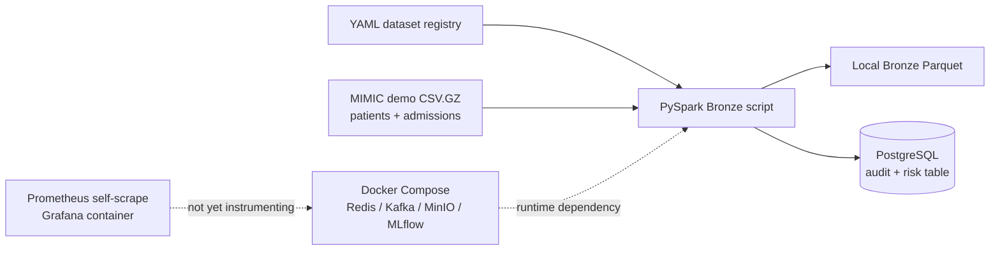
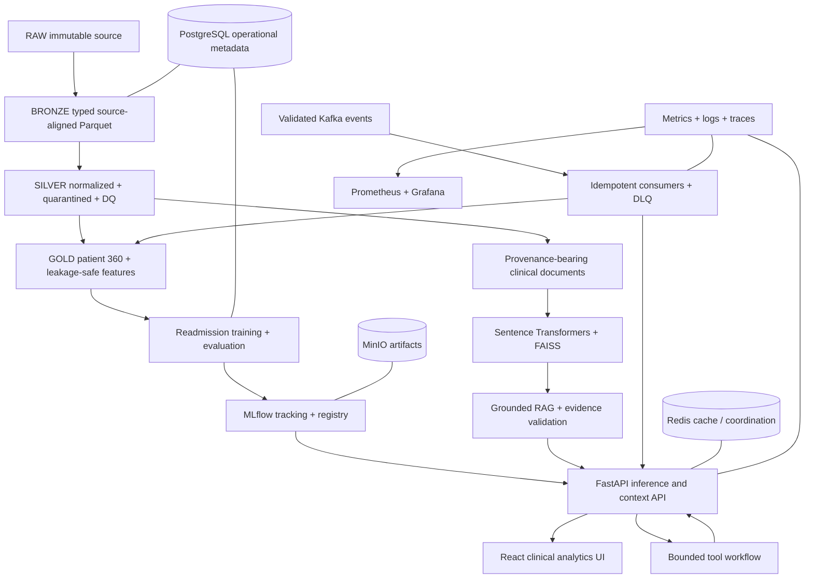

# MedNexus AI Architecture

## Scope and safety boundary

MedNexus AI is a research and educational clinical decision-support platform built on deidentified MIMIC-IV data. It is not a diagnostic system and does not replace clinical judgment. The system must distinguish measured behavior from planned behavior and must return an evidence-insufficient response when clinical retrieval cannot support an answer.

## Current architecture (implemented)

Only the solid ingestion path is represented as implemented code. Runtime behavior has not been revalidated because Docker and Python are unavailable in the current workstation session.

## Target logical architecture

## Component responsibilities

| Component | Responsibility | Failure behavior |
|---|---|---|
| Spark pipelines | Batch ingestion, normalization, DQ, and feature generation | Fail a run explicitly; preserve rejected records and audit metadata |
| PostgreSQL | Operational metadata, audit records, dataset/model versions, selected serving views | Readiness fails; pipelines do not pretend success |
| Kafka | Events that need decoupled, replayable processing | Retry bounded transient failures; invalid/permanent failures go to DLQ |
| MinIO | Durable local object/artifact storage | Training/registry operations fail safely when artifacts cannot persist |
| MLflow | Experiment tracking and versioned model lifecycle | No untracked model is promoted or silently served |
| FastAPI | Validated inference, retrieval, agent, and patient-context interfaces | Structured errors, timeouts, request IDs, and safe degradation |
| FAISS retrieval | Local semantic search with chunk provenance | Empty/weak evidence produces an insufficient-evidence response |
| Controlled agent | Schema-bound orchestration over approved tools | Iteration/time limits; no unrestricted SQL |
| React UI | Operational and clinical analytics presentation | Accessible loading, empty, stale, and error states |
| Prometheus/Grafana | Operational telemetry and dashboards | Monitoring failure must not corrupt clinical data paths |

## Data and trust boundaries

1. Raw MIMIC files are immutable inputs and never committed.
2. Bronze preserves source fidelity plus ingestion metadata.
3. Silver is the first normalized layer; invalid records are quarantined, never silently discarded.
4. Gold exposes purpose-built datasets. Predictive features enforce an explicit cutoff to prevent future-data leakage.
5. Patient-derived chunks retain subject/admission and source provenance appropriate to the deidentified dataset.
6. LLM output is untrusted until checked against retrieved evidence.
7. APIs and logs minimize clinical content; identifiers are not emitted into general telemetry.

## Deployment profiles

- **Host development:** applications use `localhost` and published Compose ports.
- **Compose network:** services use DNS names such as `postgres`, `kafka`, `minio`, and `mlflow`; Compose injects these values explicitly.
- **CI:** unit tests run without infrastructure; integration jobs start only the services they require.
- **Future production:** requires a separate threat model, secret manager, TLS, identity, backup/restore, and deployment design. Local Compose is not a production topology.

## Current decision constraints

- Keep Python as the service and ML language until another language has a measured, defensible need.
- Use Kafka only for replayable asynchronous workflows, not batch ingestion.
- Use PostgreSQL for operational metadata, not as the raw clinical lake.
- Do not introduce FHIR, HL7, or compliance claims without real mappings, validation, and governance.
- Prefer incremental modules inside the current repository over premature microservices.
